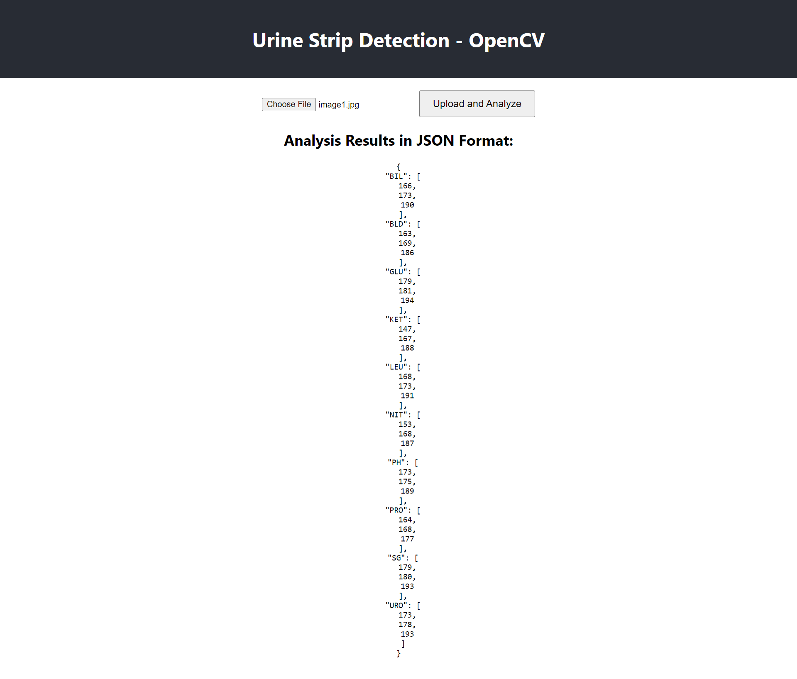

# Urine Strip Detection Web - App

This project is a web application for detecting and analyzing urine strips using OpenCV and Flask for the backend, and React for the frontend.

<div align="center">

</div>

## Introduction

The Urine Strip Detection App allows users to upload images of urine strips, which are then analyzed to detect specific colors representing different health indicators. The backend uses OpenCV for image processing, and the web interface (Frontend) is built with React to provide a user-friendly interface.

## Features

- Upload an image of a urine strip
- Analyze the image to detect colors corresponding to various health indicators
- Display the analysis results in JSON format

## Installation

- Make Sure You have Python 3.8+, Node, and Npm Installed on your Computer.

### Backend Setup

1. **Clone the repository:**

   ```bash
   git clone https://github.com/rsharvesh16/OpenCV-Backend.git
   cd urine_strip_detection/backend
   ```

2. **Create and activate a virtual environment:**

   ```bash
   python -m venv venv
   source venv/bin/activate  # On Windows use `venv\Scripts\activate`
   ```

3. **Install the required packages:**

   ```bash
   pip install -r requirements.txt
   ```

4. **Run the Flask app:**

   ```bash
   python app.py
   ```

   The backend will start running on `http://localhost:5000`.

### Frontend Setup

1. **Navigate to the frontend directory:**

   ```bash
   cd ../frontend
   ```

2. **Install the required packages:**

   ```bash
   npm install
   ```

3. **Start the React app:**

   ```bash
   npm start
   ```

   The frontend will start running on `http://localhost:3000`.

## Usage

1. Open your web browser and navigate to `http://localhost:3000`.
2. Use the file input to upload an image of a urine strip.
3. Click the "Upload and Analyze" button to send the image to the backend for analysis.
4. View the analysis results displayed in JSON format below the upload form.


By following this README, you should be able to set up, run, and use the Urine Strip Detection App effectively. If you have any further questions or issues, feel free to ask!

## License

This project is licensed under the MIT License - see the [LICENSE](LICENSE) file for details.
